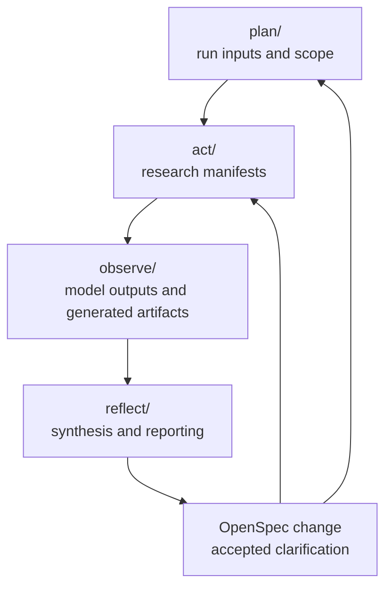
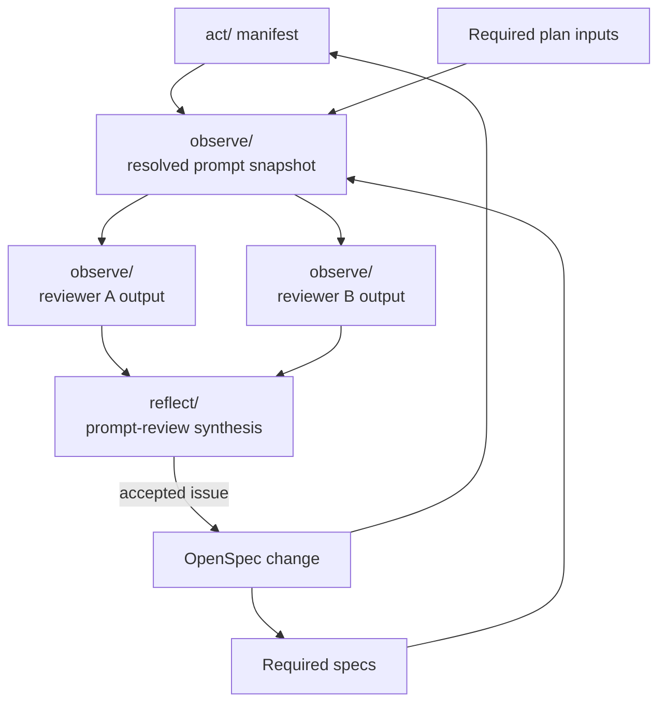

# udt-platforms-map

This repository supports Urban Digital Twin platform research with AI agents as research collaborators.

## Purpose

The goal is to map and compare the Urban Digital Twin platform ecosystem in a way that is credible, repeatable, and reviewable.

This is not a collection of one-off prompts. The repository is organized around a research methodology so human judgment is part of the whole process: defining scope, choosing inputs, running governed research actions, preserving outputs, reviewing interpretations, and reflecting findings back into the next cycle.

AI agents help execute and review research work, but the repository keeps the research definitions, assumptions, and output contracts explicit.

## Why Spec-First

OpenSpec provides the contract layer between researcher intent and agent execution.

Specs define the working research reality that agents must use: what counts as a platform, framework, module, initiative, or excluded boundary case; how platforms should be compared; what evidence is acceptable; and what output shape must be produced.

This matters because the UDT ecosystem and our understanding of it are not fixed. As definitions, comparison methods, and evidence expectations improve, those changes are captured as OpenSpec deltas. The repository therefore tracks not only research outputs, but also how the research team's understanding evolves over time.

Specs are research behavior contracts, not implementation plans. They let agents collaborate against shared definitions instead of improvising from prompt wording alone.

## Methodology

The core research loop follows action research:

```text
PLAN -> ACT -> OBSERVE -> REFLECT
```

- `plan/` contains run inputs such as selected comparison sets, benchmark fixtures, and run-specific scope material.
- `act/` contains contract manifests for resolving or running research, benchmarking, and reporting actions.
- `observe/` stores saved model outputs, generated coverage artifacts, resolved prompt snapshots, and per-agent prompt reviews.
- `reflect/` contains synthesized reporting, comparison, prompt-review, and reflection artifacts.

Phase structure and artifact naming are governed by `research-workflow-structure`.



## OpenSpec Naming

Formal contracts live in `openspec/specs/`.

Naming rules are governed by `research-workflow-structure`. In short, `research-*` specs govern cross-phase research workflow concerns, while `plan-*`, `act-*`, `observe-*`, and `reflect-*` specs govern one phase.

## Research Actions

Entity discovery is intentionally broad. It finds technical artifacts, initiatives, projects, programmes, deployments, and useful boundary candidates, then classifies them using the stable `Type` contract.

Platform comparison is the stricter evaluative stage. Only rows classified as `Type = platform` by entity discovery are eligible for platform comparison.

Canonical actions include:

- entity discovery
- platform comparison
- platform discovery benchmark
- platform discovery report
- platform comparison report

## Working With Agents

Start from the relevant OpenSpec contract, the matching `act/` manifest, and any required `plan/` input.

For a web research run:

```text
Resolve act/entity-discovery.md for web use.
```

The resolver inlines the manifest's required contracts, appends the manifest prompt body, and returns one copy-ready prompt. Paste that prompt into the selected web model, then save the response to `observe/entity-discovery-<model-short>.md`.

The repository-local shortcut for the same entity discovery resolve step is:

```text
udt:discover
```

Repository-local skills are operational shortcuts. They are not the source of truth; the specs, manifests, and run inputs are.

## Prompt Review

Prompt review checks whether a resolved prompt faithfully composes its manifest, required specs, and run inputs.

The point is to align agents on one interpretation of the specs before spending time on deep research runs. It is faster and more credible to resolve ambiguity at the contract and prompt-composition level than to wait until agents have produced large research outputs and then try to reconcile inconsistent interpretations after the fact.

The process and storage rules are governed by `research-prompt-review`.

Use this when prompt generation or agent interpretation matters:

1. Save the resolved prompt snapshot as `observe/<action>-resolved-prompt-<resolver-short>.md`.
2. Ask one or more reviewer agents to compare it against the source manifest and required contracts.
3. Save each review as `observe/<action>-prompt-review-<reviewer-short>.md`.
4. Optionally synthesize findings as `reflect/<action>-prompt-review.md`.
5. Convert accepted issues into scoped OpenSpec changes.

Reviewers look for missing contracts, missing inputs, invented behavior, duplicated behavior, output-contract mismatches, resolver mistakes, and ambiguous spec wording.



## Health Checks

Use these checks when reviewing, handing off, or committing repository work:

```bash
openspec validate --all --strict
git status --short
```

Use `openspec validate <change-name> --strict` before applying or archiving a specific OpenSpec change.

These checks confirm repository contract health and working-tree state. They do not verify research truth, evidence quality, or model-output completeness.

## Report Missing Candidates

If a platform, framework, module, initiative, or relevant excluded boundary case is missing, open a GitHub issue with the **Missing research candidate** form.

Use:

```text
Issues -> New issue -> Missing research candidate
```

Add the candidate name, a link if available, and any short note that helps triage it. Classification can be handled later.
