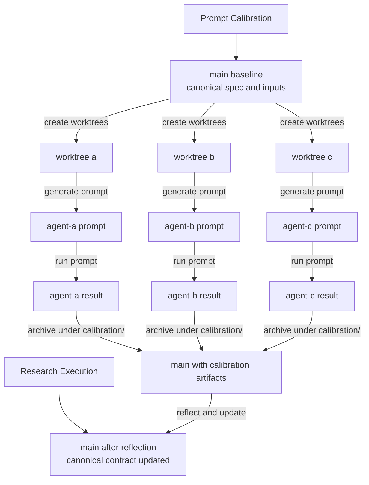

# udt-platforms-map

A spec-first research repository for governing Urban Digital Twin research agents and stabilizing the workflow they run.

This repository uses OpenSpec to govern prompt and workflow changes, and uses git to track how researchers and agents iterate on the work over time.

## Methodology

### Primary Goal

Research results in this repository are not treated as final truths. They are treated as outputs that can be added to, corrected, or improved through repeated cycles.

What must become trusted and stabilized is the workflow: how intent is specified, how prompts are governed, how outputs are compared, and how changes are traced.

This repository is a medium for governing research agents through explicit contracts, calibration, execution, and reflection.

Contributors primarily improve the workflow by calibrating prompts, refining contracts, and adding new research cycles. Agents primarily execute those cycles and generate research outputs within the governed workflow.

### Core Idea

Each OpenSpec baseline spec is a contract for a governed artifact or workflow.

For prompts, that contract defines what an agent is supposed to do when the prompt is run. The prompt is the operational rendering of the contract, not the source of truth.

Composing smaller prompts and smaller supporting artifacts is intentional. It keeps scope, criteria, source policy, prompt contracts, and run inputs separable. That makes changes easier to interpret, makes shared rules easier to reuse, and keeps humans in the loop by making the important boundaries reviewable instead of burying them in one large prompt.

That is why prompt changes should go through OpenSpec:

- the behavior change gets documented before the prompt changes
- the reason for the change is preserved in proposal, design, and spec history
- future prompt regeneration starts from a clearer contract
- shared specs can be refactored once and then reused consistently across every dependent prompt contract

When different agents execute the same prompt differently, the stronger fix is usually to tighten the governing spec rather than patch the prompt directly.

### Repository Model

The repository is organized around three research cycles:

| Cycle | Question |
| ----- | -------- |
| `udt-platforms` | What technical UDT artifacts exist? |
| `udt-initiatives` | What UDT initiatives, projects, and deployments exist? |
| `udt-platform-comparison` | How do selected UDT platforms compare side by side? |

And four Action Research phases:

```text
PLAN → ACT → OBSERVE → REFLECT
```

This repository has two main parts:

- prompt calibration: the archival layer under `calibration/`, used to compare prompt realizations and agent behavior against the same accepted contract
- research execution: the canonical layer under `plan/`, `act/`, `observe/`, and `reflect/`, used to run the research itself and get accepted results

In that sense:

- OpenSpec is the common abstraction layer shared by humans and agents for calibrating prompts and workflow behavior
- `calibration/` is the archival area where prompt and result deviations are made explicit
- the canonical repository structure is the accepted interface for doing the research and getting results

## Quick Start

| I want to... | Go to... |
| ------------ | -------- |
| inspect technical-artifact scope | `plan/udt-platforms/scope.md` |
| inspect technical-artifact source policy | `plan/udt-platforms/source-policy.md` |
| inspect initiative scope | `plan/udt-initiatives/scope.md` |
| inspect initiative source policy | `plan/udt-initiatives/source-policy.md` |
| inspect comparison rubrics | `plan/udt-platform-comparison/rubrics.md` |
| inspect comparison source policy | `plan/udt-platform-comparison/source-policy.md` |
| inspect current comparison platform set | `plan/udt-platform-comparison/platforms.md` |
| run technical-artifact mapping | `act/udt-platforms/prompt.md` |
| run platform comparison | `act/udt-platform-comparison/prompt.md` |
| check prompt/spec alignment | `act/check-prompts-status.md` |
| benchmark technical-artifact coverage | `reflect/udt-platforms/benchmarking/prompt.md` |
| consolidate technical-artifact reporting | `reflect/udt-platforms/reporting/prompt.md` |
| generate comparison reporting artifacts | `reflect/udt-platform-comparison/reporting/prompt.md` |

## Canonical Layout

```text
plan/
  udt-platforms/
  udt-initiatives/
  udt-platform-comparison/
act/
  udt-platforms/
  udt-initiatives/
  udt-platform-comparison/
  check-prompts-status.md
observe/
  udt-platforms/
  udt-initiatives/
  udt-platform-comparison/
reflect/
  udt-platforms/
  udt-initiatives/
  udt-platform-comparison/
calibration/
```

Within that structure:

- `plan/udt-platforms/scope.md` defines the technical-artifact classification criteria
- `plan/udt-platforms/source-policy.md` governs evidence priority for technical-artifact mapping
- `plan/udt-initiatives/scope.md` defines the initiative table contract
- `plan/udt-initiatives/source-policy.md` governs evidence priority for initiative and deployment mapping
- `plan/udt-platform-comparison/rubrics.md`, `source-policy.md`, and `platforms.md` define the comparison inputs
- `act/udt-platforms/prompt.md` and `act/udt-platform-comparison/prompt.md` are the canonical accepted prompts
- `observe/udt-platforms/` and `observe/udt-platform-comparison/` store saved outputs for canonical executions
- `reflect/udt-platforms/` contains benchmarking and reporting for technical-artifact mapping
- `reflect/udt-platform-comparison/` contains reporting artifacts for side-by-side platform comparison
- `calibration/` stores archival prompt/result comparisons across agents

Only rows with `Type = platform` from `udt-platforms` are eligible for `udt-platform-comparison`.

## How To Work In This Repo

### 1. Start from the planning files

- `udt-platforms` uses `plan/udt-platforms/scope.md` and `source-policy.md`
- `udt-initiatives` uses `plan/udt-initiatives/scope.md` and `source-policy.md`
- `udt-platform-comparison` uses `plan/udt-platform-comparison/rubrics.md`, `source-policy.md`, and `platforms.md`
- `plan/udt-platform-comparison/platforms.md` is per-run selection data; the other comparison inputs are slower-moving reference inputs
- the mapping cycles use their source-policy files to rank evidence, reject weak sources, and handle contradictions explicitly

### 2. Run the canonical prompts

Use:

```text
Run act/udt-platforms/prompt.md
Run act/udt-platform-comparison/prompt.md
```

The CLI asks:

```text
Run as CLI or Web?
```

- `CLI` reads the declared repository inputs directly and writes the response to `observe/<cycle>/cli-<model-short>.md`
- `Web` emits a resolved prompt with required inputs inlined; paste it into a web interface and save the result to `observe/<cycle>/web-<model-short>.md`

### 3. Use calibration to compare prompt realizations

When different agents are asked to realize the same accepted contract, store their prompt/result pairs under:

```text
calibration/<research>/<cycle>/<agent>/
```

Each calibration leaf folder contains:

- `prompt.md`
- `result.md`

These are archival comparison artifacts, not canonical research artifacts.

### 4. Reflect on saved outputs

Examples:

```text
Run reflect/udt-platforms/benchmarking/prompt.md
Run reflect/udt-platforms/reporting/prompt.md
Run reflect/udt-platform-comparison/reporting/prompt.md
```

These prompts read previously saved outputs and produce higher-level artifacts in the matching `reflect/` folder.

## Recommended Parallel-Agent Pattern

If you want to compare how different agents interpret the same accepted spec, the cleanest branching point is after the spec is accepted.

That measures prompt-level interpretation of the same contract, rather than mixing proposal interpretation, spec formation, and prompt generation into one experiment.



## Naming Conventions

| Kind | Pattern | Example |
| ---- | ------- | ------- |
| phase-cycle commit | `<phase>(<cycle>): <subject>` | `observe(udt-platforms): add claude response` |
| spec/workflow commit | `<type>(<scope>): <subject>` | `refactor(specs): rename cycles to udt-platforms` |
| agent branch | `<agent>` or `<agent>-<research>` | `agent-a`, `agent-b-udt-platforms` |
