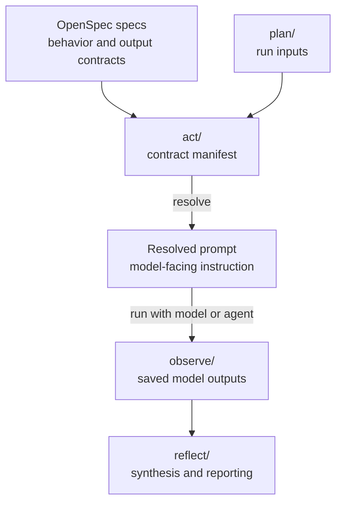
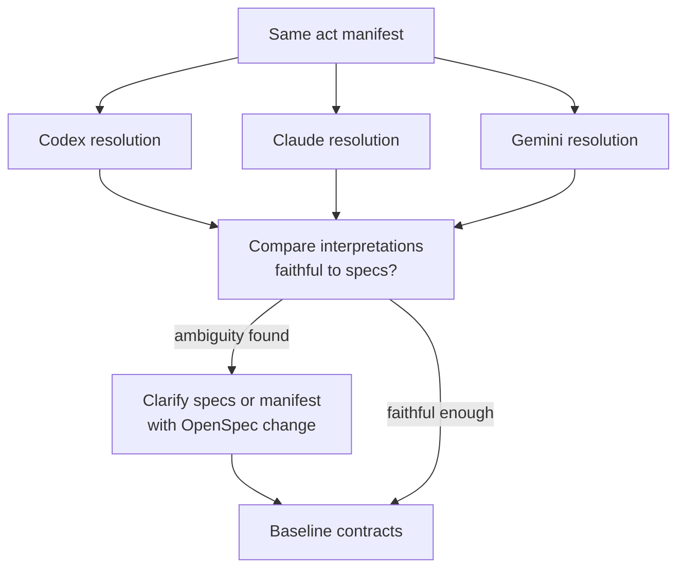

# udt-platforms-map

A spec-first research repository for collaborating with AI agents on Urban Digital Twin platform research.

## Report Missing Candidates

If a platform, framework, module, initiative, or relevant excluded boundary case is missing, open a GitHub issue with the **Missing research candidate** form.

Use:

```text
Issues -> New issue -> Missing research candidate
```

Provide the candidate name, an official link, and a short explanation of why it should be included. Choose `Not sure` in the category dropdown when classification is unclear.

This repository separates expected model behavior from prompt wording.

An OpenSpec spec is a behavior contract, not an implementation plan.
In this repository, specs define what a research action must do: classification behavior, source policies, scoring rules, output contracts, and prompt-manifest structure.

The `act/` files are contract manifests. They list which specs and run inputs affect an action, with short purpose comments, but they are not the full behavior source and are not usually pasted directly into a web model.

Resolving a manifest combines the required specs and run inputs into a concrete prompt for a specific model or agent. The resolved prompt is the operational instruction; the specs remain the source of expected behavior.

Repository-local skills can provide shortcuts for common manifest resolution tasks. They do not replace the specs or manifests; they read the live contracts and assemble the operational prompt.

This repo uses OpenSpec because the research actions are not one-time prompts.
They are rerun, reviewed, compared, and improved over time, so they need explicit inputs, output contracts, review history, and traceable changes.

The separation makes prompt tuning more precise. A researcher can clarify the behavior contract once, then resolve or regenerate prompts from that contract. Resolving the same manifest with different agents, such as Codex, Claude, and Gemini, can also validate interpretations: differences point to ambiguity in the specs or manifest, and accepted clarifications become OpenSpec changes.

Small prompts and one-off experiments can still be direct when they are outside the governed workflow.

Git records how the research artifacts and contracts evolve over time.

## Workflow

The repository follows an action research loop:

```text
PLAN -> ACT -> OBSERVE -> REFLECT
```

- `plan/` contains run inputs such as selected comparison sets, benchmark fixtures, and run-specific scope material.
- `act/` contains contract manifests for resolving or running research, benchmarking, and reporting actions.
- `observe/` stores saved model outputs and generated coverage artifacts.
- `reflect/` contains synthesized reporting, comparison, and reflection artifacts.

## Research Actions

The first discovery actions are intentionally broad:

- Platform discovery finds technical artifacts and classifies them using the stable `Type` contract.
- Initiative discovery finds projects, programmes, and deployments, and records `Uses = ?` when the technical substrate is unclear.

Platform comparison is the stricter evaluative stage. Only rows classified as `Type = platform` by platform discovery are eligible for platform comparison.

Canonical actions include:

- discover entities
- compare platforms
- benchmark platform discovery
- report platform discovery
- benchmark platform comparison
- report platform comparison

## How To Work

1. Start from the relevant behavior spec in `openspec/specs/` and any run input in `plan/`.
2. Resolve the matching manifest from `act/` into a concrete prompt, or run it in an AI CLI when the manifest is CLI-oriented.
3. Run the resolved prompt with the selected model or agent.
4. Save raw model outputs and coverage artifacts in `observe/`.
5. Synthesize reports, comparisons, and reflections in `reflect/`.
6. Improve specs, manifests, and workflow behavior through OpenSpec changes.

Example for a web research run:

```text
Resolve act/discover-entities.md for web use.
```

The resolver inlines the manifest's required contracts, appends the manifest prompt body, and returns one copy-ready prompt.
Use `/copy` to copy the generated prompt, paste it into the web model, then save the response to `observe/entity-discovery-<model-short>.md`.

Shortcut for the same entity discovery resolve step:

```text
udt:discover
```

The local skill at `.codex/skills/udt-discover/` resolves the live manifest and contracts. If assistant-side `/copy` is available, the skill should copy the resolved prompt; otherwise run `/copy` on the generated prompt.

A useful reviewer question is: does the resolved prompt faithfully compose the required contracts?





## Health Checks

Use these checks when reviewing, handing off, or committing repository work:

```bash
openspec validate --all --strict
git status --short
```

Use `openspec validate <change-name> --strict` before applying or archiving a specific OpenSpec change.
These checks confirm repository contract health and working-tree state; they do not verify research truth, evidence quality, or model-output completeness.

## Specs

Formal repository contracts live in [openspec/specs/](openspec/specs/), especially:

- [repo-structure](openspec/specs/repo-structure/spec.md)
- [repo-naming-conventions](openspec/specs/repo-naming-conventions/spec.md)
- [repo-prompt-review](openspec/specs/repo-prompt-review/spec.md)
- [repo-act-prompt-manifest](openspec/specs/repo-act-prompt-manifest/spec.md)
- [repo-web-prompt-template](openspec/specs/repo-web-prompt-template/spec.md)
- [repo-agent-skills](openspec/specs/repo-agent-skills/spec.md)
- [repo-readme](openspec/specs/repo-readme/spec.md)
- [entity-definition](openspec/specs/entity-definition/spec.md)
- [platform-comparison-rubric](openspec/specs/platform-comparison-rubric/spec.md)
- [platform-source-policy](openspec/specs/platform-source-policy/spec.md)
