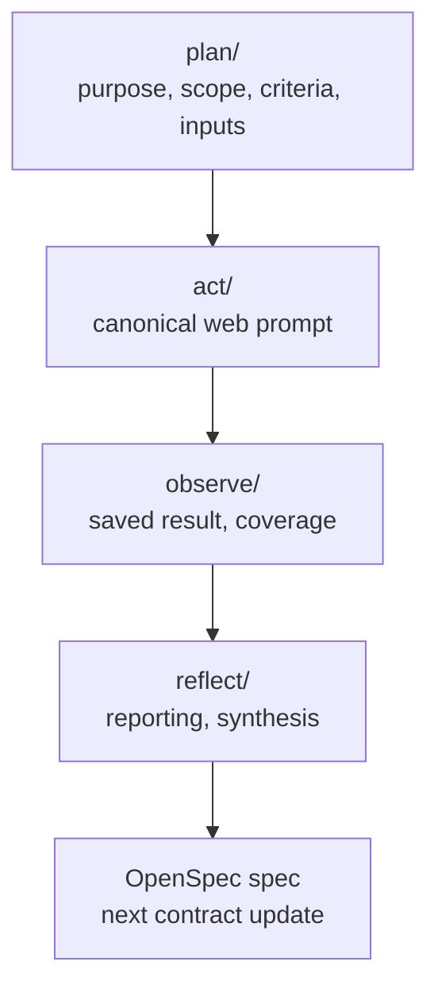
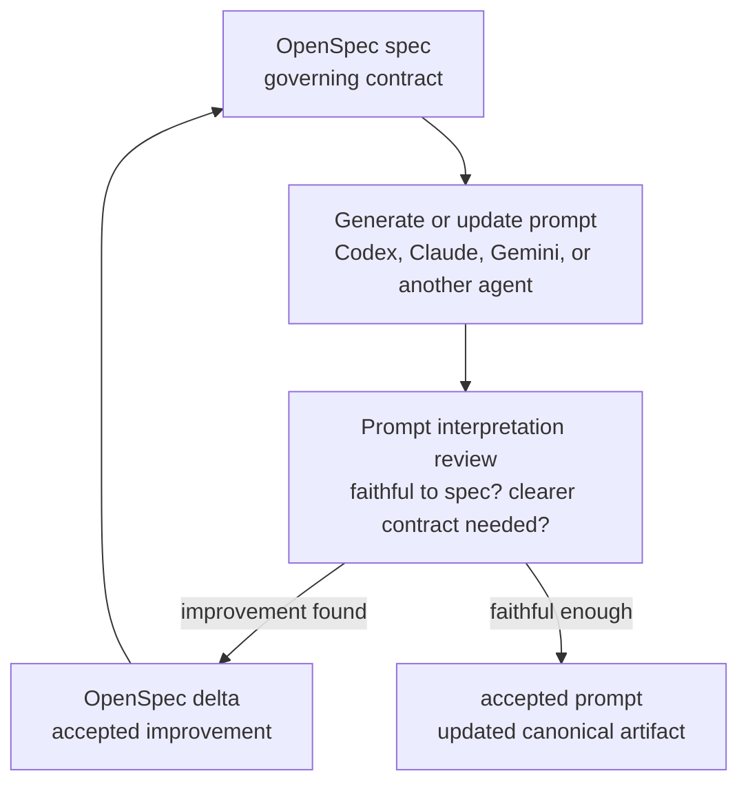

# udt-platforms-map

A spec-first research repository for collaborating with AI agents on Urban Digital Twin platform research.

OpenSpec keeps prompts, outputs, and workflow changes explicit and reviewable. Git records how the research artifacts and contracts evolve over time.

## Workflow

The repository follows an action research loop:

```text
PLAN -> ACT -> OBSERVE -> REFLECT
```

- `plan/` defines research objects, scope, criteria, selected inputs, and benchmark fixtures.
- `act/` contains canonical prompt templates for running research, benchmarking, and reporting actions.
- `observe/` stores saved model outputs and generated coverage artifacts.
- `reflect/` contains synthesized reporting, comparison, and reflection artifacts.

Each phase folder has a local README:

- [plan/README.md](plan/README.md)
- [act/README.md](act/README.md)
- [observe/README.md](observe/README.md)
- [reflect/README.md](reflect/README.md)

Live artifact names use researcher-facing object, action, and role language, such as `observe/platform-discovery-claude.md` or `reflect/platform-ecosystem.md`. They do not repeat the old `udt-` prefix.

## Research Actions

The first discovery actions are intentionally broad:

- Platform discovery finds technical artifacts and classifies them using the stable `Type` contract.
- Initiative discovery finds projects, programmes, and deployments, and records `Uses = ?` when the technical substrate is unclear.

Platform comparison is the stricter evaluative stage. Only rows classified as `Type = platform` by platform discovery are eligible for platform comparison.

Canonical actions include:

- discover platforms
- discover initiatives
- compare platforms
- benchmark platform discovery
- report platform discovery
- benchmark platform comparison
- report platform comparison

## How To Work

1. Start from the relevant planning file in `plan/`.
2. Run the matching canonical prompt from `act/`.
3. Save raw model outputs and coverage artifacts in `observe/`.
4. Synthesize reports, comparisons, and reflections in `reflect/`.
5. Improve prompts and workflow behavior through OpenSpec changes.

Prompt interpretation review replaces the old calibration-folder workflow. One agent can generate or update a prompt from a governing spec, another agent reviews whether the prompt faithfully interprets that spec, and accepted improvements are captured as OpenSpec deltas before updating the baseline.

## Workflow Diagrams

### Research Execution



### Prompt Interpretation Review



## Specs

Formal repository contracts live in [openspec/specs/](openspec/specs/), especially:

- [repo-structure](openspec/specs/repo-structure/spec.md)
- [repo-naming-conventions](openspec/specs/repo-naming-conventions/spec.md)
- [repo-prompt-review](openspec/specs/repo-prompt-review/spec.md)
- [repo-readme](openspec/specs/repo-readme/spec.md)

## Future Directions

- Markdown-native relationship metadata, such as YAML frontmatter or a relationship layer, could eventually make artifact dependencies easier to inspect.
- Higher-level agent skills could make common research actions easier to invoke while keeping the underlying prompts and specs governed.
