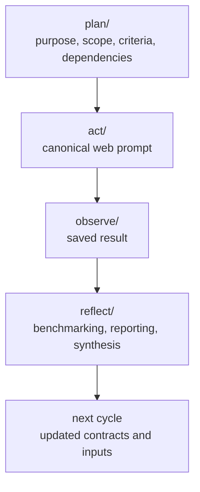
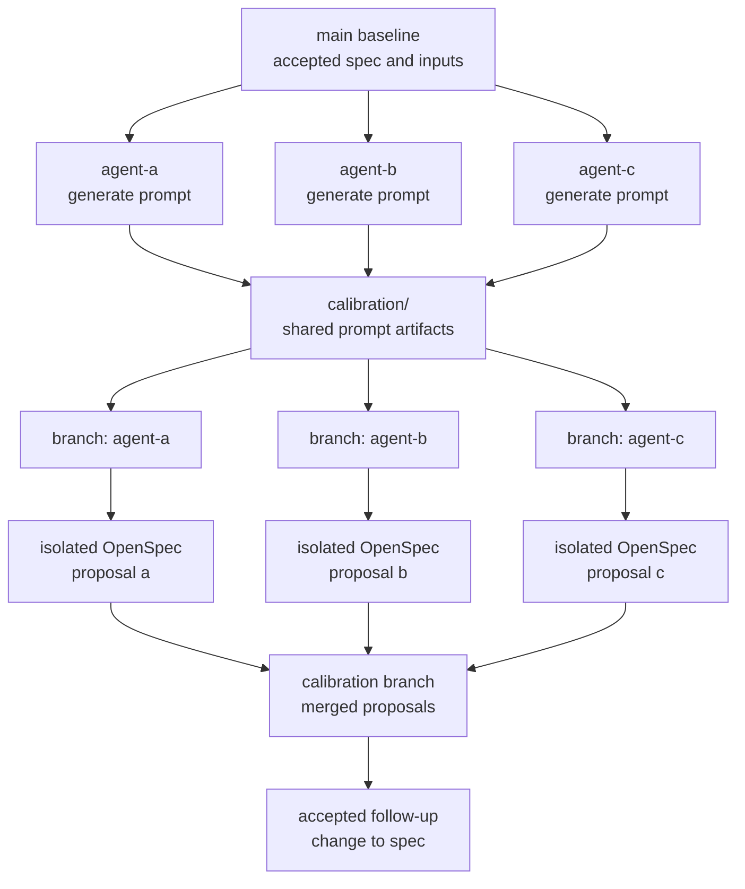

# udt-platforms-map

A spec-first research repository for governing Urban Digital Twin research agents and stabilizing the workflow they run.

This repository uses OpenSpec to govern prompt and workflow changes, and uses git to track how researchers and agents iterate on the work over time.

## Methodology

### Primary Goal

Research results in this repository are not treated as final truths.
They are treated as outputs that can be added to, corrected, or improved through repeated cycles.

What must become trusted and stabilized is the workflow:

- how intent is specified,
- how prompts are governed,
- how outputs are compared, and
- how changes are traced.

This repository is a medium for governing research agents through explicit contracts, Continual AI Review, execution, and reflection.

Contributors primarily improve the workflow by calibrating prompts, refining contracts, and adding new research cycles.
Agents primarily execute those cycles and generate research outputs within the governed workflow.

### Core Idea

Each OpenSpec baseline spec is a contract for a governed artifact or workflow.

For prompts, that contract defines what an agent is supposed to do when the prompt is run.
The prompt is the operational rendering of the contract, not the source of truth.

That is why prompt changes should go through OpenSpec:

- the behavior change gets documented before the prompt changes
- the reason for the change is preserved in proposal, design, and spec history
- future prompt regeneration starts from a clearer contract
- shared specs can be refactored once and then reused consistently across every dependent prompt contract

When different agents execute the same prompt differently, the stronger fix is usually to tighten the governing spec rather than patch the prompt directly.

Composing smaller prompts and smaller supporting artifacts is intentional.
It keeps scope, criteria, prompt contracts, and run inputs separable.
That makes changes easier to interpret, makes shared rules easier to reuse, and keeps humans in the loop by making the important boundaries reviewable instead of burying them in one large prompt.

### Contract Composition

Specs can relate to each other in three common ways:

- An artifact-specific contract governs one artifact or workflow, such as a prompt spec governing one prompt file.
- A cross-cutting contract governs a repeated rule across multiple artifacts, such as shared Markdown formatting rules for governed prompt templates.
- A prompt-specific or workflow-specific contract may reference a shared contract when it needs that rule without duplicating the full text.

Prefer shared cross-cutting contracts for rules that must stay consistent across multiple prompts or workflows.
Prefer explicit references from artifact-specific specs when traceability matters.
Avoid duplicating shared rules unless local readability is more important than the risk of drift.

### Repository Model

The repository is organized around complementary research threads.
These threads are not cycles in themselves.
The cycle is the repeated Action Research loop across phases:

```text
PLAN → ACT → OBSERVE → REFLECT
```

Each thread has its own artifacts across those phases.
Planning inputs and canonical act prompts are direct files under `plan/` and `act/`, named with their thread prefix.
Saved outputs and reflection work remain grouped by thread under `observe/` and `reflect/`.
That keeps prompts and supporting artifacts smaller, narrower, and easier to compose.
Composing smaller prompts is not only a prompt-design choice; it is the mechanism that lets humans steer the workflow without rewriting the whole system each time.

That decomposition is also what keeps humans in the loop:

- Scope can be adjusted without rewriting execution prompts
- Comparison criteria can be tightened without rewriting discovery prompts
- One thread can be redirected without destabilizing the whole repository
- Reflection can connect threads and let results from one thread influence another

The plan phase carries the thread-level interpretation of the workflow:

- each thread has its own planning material describing its purpose and inputs as direct files under `plan/`
- plan-level dependency documentation explains how threads depend on and inform each other

The first two threads are broad global discovery threads:

- `udt-platforms` casts a wide net over technical artifacts and classifies them using a stable `Type` contract
- `udt-initiatives` casts a wide net over projects, programmes, and deployments and records `Uses = ?` when the technical substrate is unclear

The stricter evaluative stage is `udt-platform-comparison`, where the selected platform set is compared using tighter criteria and stronger evidence expectations.

The repository has two main parts:

- Continual AI Review: the archival layer under `calibration/`, used to compare how different agents interpret the same governing spec before accepted contract changes return to `main`
- Research execution: the canonical layer under `plan/`, `act/`, `observe/`, and `reflect/`, used to run the research itself and get accepted results

Git history is part of the workflow, not just storage.
Together, the repository structure and git history make it possible to inspect how a result was produced:

- the workflow shows which phase artifacts shaped the result
- the git log shows when those artifacts changed
- branches and calibration history show how prompt interpretation was calibrated
- the resulting history shows how much a saved result reflects an up-to-date view of the ecosystem rather than an older contract or older evidence base

In that sense:

- OpenSpec is the common abstraction layer shared by humans and agents for calibrating prompts and workflow behavior
- `calibration/` is the archival area where prompt and result deviations are made explicit
- the canonical repository structure is the accepted interface for doing the research and getting results

## How To Work In This Repo

### 1. Start in `plan/`

Start from the planning artifacts for the thread you are working on.
That is where purpose, scope, comparison criteria where applicable, and thread dependencies are made explicit before execution.
Canonical planning entrypoints are direct files such as `plan/udt-platforms-scope.md`, `plan/udt-initiatives-scope.md`, and `plan/udt-platform-comparison-platforms.md`.

### 2. Run canonical prompts from `act/`

Use the canonical web prompts:

```text
Run act/udt-platforms.md
Run act/udt-initiatives.md
Run act/udt-platform-comparison.md
```

Canonical act prompts resolve their declared planning inputs into copy-ready web prompts for the matching thread.

### 3. Save outputs under `observe/` and synthesize under `reflect/`

Saved canonical web outputs belong in `observe/`.
Reflection, benchmarking, and reporting belong in `reflect/`.
This is where one thread can inform another and where the next cycle gets shaped.

### 4. Use `calibration/` for Continual AI Review, not canonical research state

When calibrating a governed prompt spec:

- first generate prompts from the same accepted spec
- save those prompts under `calibration/<spec-name>/c01/<agent>/prompt.md`
- only after all prompts are visible, branch by agent
- let each agent create its own isolated OpenSpec proposal
- merge those proposals into a dedicated calibration branch
- decide what to keep there before accepted changes go back to `main`

The credibility of this process depends on isolated context before merge:

- agents may share the governing spec and generated prompts
- agents do not see other agents' proposals before merge
- independent proposals are therefore stronger evidence of real ambiguity in the spec

This is not canonical research state.
It is calibration evidence for tightening the workflow.

Read more:
`openspec/changes/archive/2026-04-29-reframe-calibration-as-isolated-spec-review/`

## Workflow Diagrams

### Research Execution



### Continual AI Review



## Naming and Repository Structure

The live repository structure is governed by:

- [openspec/specs/repository-structure/spec.md](openspec/specs/repository-structure/spec.md)

Workflow naming conventions are governed by:

- [openspec/specs/workflow-naming-conventions/spec.md](openspec/specs/workflow-naming-conventions/spec.md)

Use those specs as the source of truth for:

- canonical phase and thread locations
- calibration path and cycle naming expectations
- branch naming
- commit naming
- OpenSpec change naming

## Future Directions

- A possible future direction is to adopt a Markdown-native relationship layer such as [Tolaria](https://tolaria.md/) and use YAML frontmatter on governed files to express purpose, dependencies, and thread relationships directly in each document.
  If that happens, per-file frontmatter could replace or reduce the need for separate dependency-mapping documents, while keeping relationships inspectable through plain files and git history.
  This is only a future direction. The current repository does not require frontmatter on all Markdown files, and the current workflow remains the source of truth.
- Another future direction is to simplify the workflow for end users through higher-level skills that wrap the internal repository mechanics, similar in spirit to the skill-driven workflow system described by [The Unfinishable Map](https://unfinishablemap.org/workflow/).
  That would let users invoke named workflow actions while the underlying prompts, files, and git operations remain governed by the repository.
