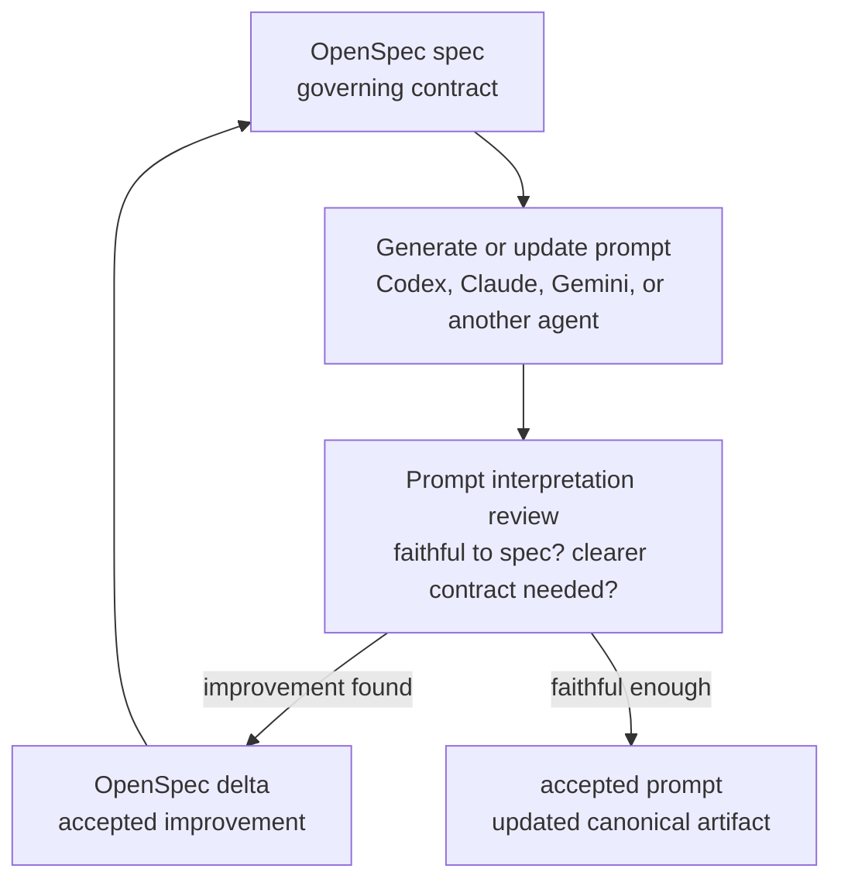
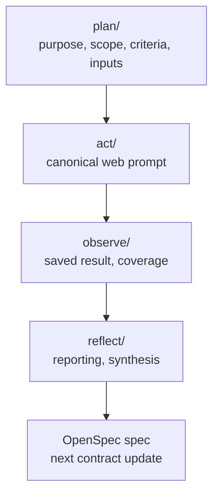

# udt-platforms-map

A spec-first research repository for governing Urban Digital Twin research agents and stabilizing the workflow they run.

This repository uses OpenSpec to govern prompt and workflow changes, and uses git to track how researchers and agents iterate on the work over time.

## Methodology

### Primary Goal

Research results in this repository are not treated as final truths.
They are treated as outputs that can be added to, corrected, or improved through repeated cycles.

What must become trusted and stabilized is the workflow:

- how intent is specified
- how prompts are governed
- how outputs are compared
- how changes are traced

This repository is a medium for governing research agents through explicit contracts, prompt interpretation review, execution, and reflection.

Contributors primarily improve the workflow by refining OpenSpec contracts, reviewing prompt interpretations, and adding new research work.
Agents primarily execute the governed prompts and help review whether those prompts faithfully implement the specs.

### Core Idea

Each OpenSpec baseline spec is a contract for a governed artifact or workflow.

For prompts, that contract defines what an agent is supposed to do when the prompt is run.
The prompt is the operational rendering of the contract, not the source of truth.

That is why prompt changes should go through OpenSpec:

- the behavior change gets documented before the prompt changes
- the reason for the change is preserved in proposal, design, and spec history
- future prompt regeneration starts from a clearer contract
- shared specs can be refactored once and then reused consistently across every dependent prompt contract

When a prompt is unclear, incomplete, or interpreted differently by another agent, the stronger fix is usually to tighten the governing spec rather than patch the prompt directly.

Composing smaller prompts and smaller supporting artifacts is intentional.
It keeps scope, criteria, prompt contracts, and run inputs separable.
That makes changes easier to interpret, makes shared rules easier to reuse, and keeps humans in the loop by making important boundaries reviewable instead of burying them in one large prompt.

### Contract Composition

Specs can relate to each other in three common ways:

- An artifact-specific contract governs one artifact or workflow, such as a prompt spec governing one prompt file.
- A cross-cutting contract governs a repeated rule across multiple artifacts, such as shared Markdown formatting rules for governed prompt templates.
- A prompt-specific or workflow-specific contract may reference a shared contract when it needs that rule without duplicating the full text.

Prefer shared cross-cutting contracts for rules that must stay consistent across multiple prompts or workflows.
Prefer explicit references from artifact-specific specs when traceability matters.
Avoid duplicating shared rules unless local readability is more important than the risk of drift.

### Repository Model

The repository is organized around research objects and research actions.
The cycle is the repeated Action Research loop across phases:

```text
PLAN -> ACT -> OBSERVE -> REFLECT
```

Planning inputs, canonical act prompts, observed outputs, and reflection artifacts are direct files under their phase folders.
Live filenames use researcher-facing object, action, and role language, such as `observe/platform-discovery-claude.md` or `reflect/platform-ecosystem.md`.
Each phase folder has a local `README.md` that explains its contents and naming expectations:

- [plan/README.md](plan/README.md)
- [act/README.md](act/README.md)
- [observe/README.md](observe/README.md)
- [reflect/README.md](reflect/README.md)

The first two research actions are broad global discovery actions:

- platform discovery casts a wide net over technical artifacts and classifies them using a stable `Type` contract
- initiative discovery casts a wide net over projects, programmes, and deployments and records `Uses = ?` when the technical substrate is unclear

The stricter evaluative stage is platform comparison, where the selected platform set is compared using tighter criteria and stronger evidence expectations.

Historical OpenSpec archive entries may still mention older `udt-*` filenames and thread names. Those names are historical only; the live repository uses the researcher-facing filenames shown in the phase folders.

The repository has two main responsibilities:

- Prompt and workflow governance through OpenSpec specs, changes, and archived change history
- Research execution through the canonical `plan/`, `act/`, `observe/`, and `reflect/` folders

Git history is part of the workflow, not just storage.
Together, OpenSpec history, repository structure, and commits make it possible to inspect how a result was produced:

- the specs show which contract governed the work
- the OpenSpec change archive shows why contracts changed
- the phase folders show which artifacts shaped a result
- the git log shows when those artifacts changed

In that sense, OpenSpec is the common abstraction layer shared by humans and agents for improving prompts and workflow behavior.
The canonical repository structure is the accepted interface for doing the research and getting results.

## Prompt Interpretation Review

Prompt interpretation review is the replacement for the old calibration-folder workflow.

The review loop is sequential:

1. Start from a governing OpenSpec spec.
2. Ask one agent, such as Codex, to generate or update the prompt from that spec.
3. Ask a second agent, such as Claude, whether the prompt is a faithful interpretation of the spec and whether the contract can be clearer.
4. If the review finds a real improvement, capture it as an OpenSpec delta.
5. Regenerate or update the prompt from the improved contract.
6. Ask the next agent, such as Gemini, to review the current prompt against the current spec/change state.

Accepted review feedback belongs in OpenSpec changes, not in standalone review artifacts.
Archived OpenSpec changes are the audit trail for prompt-review decisions.

This workflow is intentionally sequential.
Later reviewers may see earlier accepted deltas because the goal is iterative improvement of the contract and prompt, not blind comparison between isolated agents.

## How To Work In This Repo

### 1. Start In `plan/`

Start from the planning artifacts for the research object or action you are working on.
That is where purpose, scope, comparison criteria, selected inputs, and action dependencies are made explicit before execution.
Canonical planning entrypoints are direct files such as `plan/platform-definition.md`, `plan/initiative-definition.md`, `plan/platform-comparison-set.md`, and `plan/platform-discovery-benchmark.md`.

### 2. Run Canonical Prompts From `act/`

Use the canonical web prompts:

```text
Run act/discover-platforms.md
Run act/discover-initiatives.md
Run act/compare-platforms.md
Run act/benchmark-platform-discovery.md
Run act/report-platform-discovery.md
Run act/report-platform-comparison.md
```

Canonical act prompts resolve their declared planning inputs into copy-ready web prompts for the matching research action.

### 3. Save Outputs Under `observe/` And Synthesize Under `reflect/`

Saved canonical web outputs and generated coverage reports belong in `observe/` as direct files.
Synthesized reporting and reflection outputs belong in `reflect/` as direct files.
This is where one research action can inform another and where the next cycle gets shaped.

### 4. Improve Prompts Through OpenSpec Review

When a prompt needs review or improvement, start an OpenSpec change.
Use prompt interpretation review to compare the prompt against its governing spec, then capture accepted feedback as scoped deltas.

Do not create a separate calibration artifact tree.
The OpenSpec change and its archive entry are the record.

## Workflow Diagrams

### Prompt Interpretation Review



### Research Execution



## Naming and Repository Structure

The live repository structure is governed by:

- [openspec/specs/repo-structure/spec.md](openspec/specs/repo-structure/spec.md)

Workflow naming conventions are governed by:

- [openspec/specs/repo-naming-conventions/spec.md](openspec/specs/repo-naming-conventions/spec.md)

Prompt interpretation review is governed by:

- [openspec/specs/repo-prompt-review/spec.md](openspec/specs/repo-prompt-review/spec.md)

README documentation entrypoints are governed by:

- [openspec/specs/repo-readme/spec.md](openspec/specs/repo-readme/spec.md)

Use those specs as the source of truth for:

- canonical phase locations and artifact names
- README documentation entrypoints
- prompt-review expectations
- branch naming
- commit naming
- OpenSpec change naming

## Future Directions

- A possible future direction is to adopt a Markdown-native relationship layer such as [Tolaria](https://tolaria.md/) and use YAML frontmatter on governed files to express purpose, dependencies, and artifact relationships directly in each document.
  If that happens, per-file frontmatter could replace or reduce the need for separate dependency-mapping documents, while keeping relationships inspectable through plain files and git history.
  This is only a future direction. The current repository does not require frontmatter on all Markdown files, and the current workflow remains the source of truth.
- Another future direction is to simplify the workflow for end users through higher-level skills that wrap the internal repository mechanics, similar in spirit to the skill-driven workflow system described by [The Unfinishable Map](https://unfinishablemap.org/workflow/).
  That would let users invoke named workflow actions while the underlying prompts, files, and git operations remain governed by the repository.
