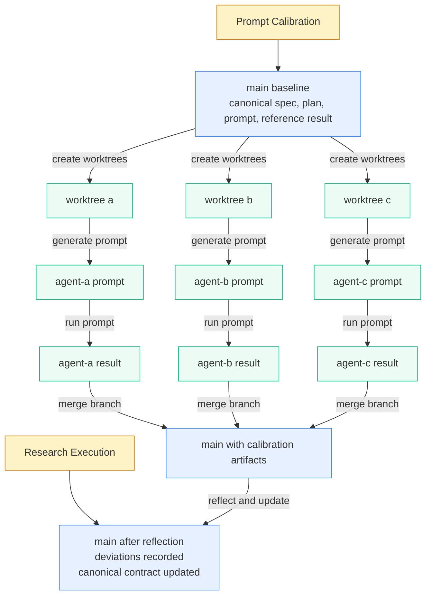

# udt-platforms-map

A spec-first research repository for mapping the Urban Digital Twin ecosystem around DTCC.

This repository uses OpenSpec to govern prompts and workflow changes, and uses git to track how researchers and agents iterate on the work over time.

## Methodology

### Primary Goal

Research results in this repository are not treated as final truths. They are treated as outputs that can be added to, corrected, or improved through repeated cycles.

What must become trusted and stabilized is the workflow: how intent is specified, how prompts are governed, how outputs are compared, and how changes are traced.

This repository is a medium for governing research agents through explicit contracts, calibration, execution, and reflection.

Contributors primarily improve the workflow by calibrating prompts, refining contracts, and adding new research cycles. Agents primarily execute those cycles and generate research outputs within the governed workflow.

### Core Idea

Each OpenSpec baseline spec is a contract for a governed artifact or workflow.

For prompts, that contract defines what an agent is supposed to do when the prompt is run. The prompt is the operational rendering of the contract, not the source of truth.

Composing smaller prompts and smaller supporting artifacts is intentional.
It keeps scope, criteria, source policy, prompt contracts, and run inputs separable.
That makes changes easier to interpret, makes shared rules easier to reuse, and keeps humans in the loop by making the important boundaries reviewable instead of burying them in one large prompt.

That is why prompt changes should go through OpenSpec:

- the behavior change gets documented before the prompt changes
- the reason for the change is preserved in proposal, design, and spec history
- future prompt regeneration starts from a clearer contract
- shared specs can be refactored once and then reused consistently across every dependent prompt contract

When different agents execute the same prompt differently, the stronger fix is usually to tighten the governing spec rather than patch the prompt directly.
That improves reproducibility because the workflow becomes more explicit at the contract level.

Different prompt text from the same spec is expected. The spec defines the contract, not exact wording. Different agents may vary in:

- phrasing
- ordering
- emphasis
- examples
- instruction density

What matters is contract fidelity:

- do they preserve the same requirements?
- do they enforce the same boundaries?
- do they produce the same intended behavior?

If repeated prompt divergence leads to materially different governed behavior, that is evidence that the spec needs to be tightened.

The same proposal can also lead different agents to write different `spec.md` wording.
That is acceptable if the resulting contract is equivalent.
If the resulting contract is not equivalent, the proposal or design layer was not specific enough.

### Repository Model

The repository is organized around two research cycles:

| Cycle       | Question                                        |
| ----------- | ----------------------------------------------- |
| `discovery` | Which UDT platforms exist across the ecosystem? |
| `rating`    | How should selected core platforms be compared? |

And four Action Research phases:

```text
PLAN → ACT → OBSERVE → REFLECT
```

| Phase      | Purpose                                                                            |
| ---------- | ---------------------------------------------------------------------------------- |
| `plan/`    | current cycle inputs such as scope, rubrics, source policy, and selected platforms |
| `act/`     | accepted canonical prompts and maintenance prompts                                 |
| `observe/` | accepted reference outputs and saved raw outputs from canonical executions         |
| `reflect/` | benchmarking, reporting, deviations, and synthesis                                 |

This repository has two main parts:

- prompt calibration: the archival layer under `calibration/`, used to compare prompt realizations and agent behavior against the same accepted contract
- research execution: the canonical layer under `plan/`, `act/`, `observe/`, and `reflect/`, used to run the research itself and get accepted results

In that sense:

- OpenSpec is the common abstraction layer shared by humans and agents for calibrating prompts and workflow behavior
- `calibration/` is the archival area where prompt and result deviations are made explicit
- the canonical repository structure is the accepted interface for doing the research and getting results

## Quick Start

| I want to...                        | Go to...                                   |
| ----------------------------------- | ------------------------------------------ |
| inspect discovery scope             | `plan/discovery/scope.md`                  |
| inspect rating rubrics              | `plan/rating/rubrics.md`                   |
| inspect rating source policy        | `plan/rating/source-policy.md`             |
| inspect current rating platform set | `plan/rating/platforms.md`                 |
| run discovery                       | `act/discovery/prompt.md`                  |
| run rating                          | `act/rating/prompt.md`                     |
| check prompt/spec alignment         | `act/check-prompts-status.md`              |
| benchmark discovery coverage        | `reflect/discovery/benchmarking/prompt.md` |
| consolidate discovery reporting     | `reflect/discovery/reporting/prompt.md`    |
| generate rating reporting artifacts | `reflect/rating/reporting/prompt.md`       |

## Canonical Layout

The canonical research interface uses:

```text
plan/
  discovery/
  rating/
act/
  discovery/
  rating/
  check-prompts-status.md
observe/
  discovery/
  rating/
reflect/
  discovery/
  rating/
calibration/
```

Within that structure:

- `plan/discovery/scope.md` defines discovery classification criteria
- `plan/rating/rubrics.md`, `plan/rating/source-policy.md`, and `plan/rating/platforms.md` define the rating comparison inputs
- `act/discovery/prompt.md` and `act/rating/prompt.md` are the canonical accepted prompts
- `act/check-prompts-status.md` is the maintenance prompt for checking live prompt/spec alignment
- `observe/discovery/` and `observe/rating/` store accepted and saved outputs for canonical executions
- `reflect/` contains benchmarking, reporting, deviations, and other reflection artifacts
- `calibration/` stores archival prompt/result comparisons across agents

## How To Work In This Repo

### 1. Start from the planning files

- Discovery uses `plan/discovery/scope.md`.
- Rating uses `plan/rating/rubrics.md`, `plan/rating/source-policy.md`, and `plan/rating/platforms.md`.
- `plan/rating/platforms.md` is per-run selection data. The others are slower-moving reference inputs.

### 2. Run the canonical prompts

Use:

```text
Run act/discovery/prompt.md
Run act/rating/prompt.md
```

The CLI asks:

```text
Run as CLI or Web?
```

- `CLI` reads the declared repository inputs directly and writes the response to `observe/<cycle>/cli-<model-short>.md`
- `Web` emits a resolved prompt with required inputs inlined; paste it into a web interface and save the result to `observe/<cycle>/web-<model-short>.md`

### 3. Use calibration to compare prompt realizations

When different agents are asked to realize the same accepted contract, store their prompt/result pairs under:

```text
calibration/<research>/<cycle>/<agent>/
```

Each calibration leaf folder currently contains:

- `prompt.md`
- `result.md`

These are archival comparison artifacts, not canonical research artifacts.

### 4. Reflect on saved outputs

Examples:

```text
Run reflect/discovery/benchmarking/prompt.md
Run reflect/discovery/reporting/prompt.md
Run reflect/rating/reporting/prompt.md
```

These prompts read previously saved outputs and produce higher-level artifacts in the matching `reflect/` folder.

## Recommended Parallel-Agent Pattern

If you want to compare how different agents interpret the same accepted spec, the cleanest branching point is after the spec is accepted.

That measures prompt-level interpretation of the same contract, rather than mixing proposal interpretation, spec formation, and prompt generation into one experiment.

Branching earlier answers a different question:

- branch after proposal: measures variation in interpreting the intended change itself
- branch after spec: measures variation in operationalizing the same accepted contract

For this repository, the second is usually the more useful experiment because the spec is the explicit form of intent.

One workable pattern is:



This pattern is useful because:

- all agents start from the same accepted spec baseline
- prompt differences become visible as differences in interpretation of the same contract
- repeated deviations can be fed back into the spec instead of patched ad hoc in prompt text
- `calibration/<research>/<cycle>/<agent>/...` keeps research meaning, cycle meaning, and agent ownership separate in the path

## Traceability Model

Different layers of knowledge are stored in different places:

| What is tracked                                                   | Primary location                          |
| ----------------------------------------------------------------- | ----------------------------------------- |
| accepted scope, rubrics, source policy, and selected platform set | `plan/`                                   |
| canonical prompt contracts and governed workflow behavior         | `openspec/specs/` and `openspec/changes/` |
| canonical accepted prompts                                        | `act/`                                    |
| saved outputs and reference observations                          | `observe/`                                |
| calibration runs across prompts and agents                        | `calibration/`                            |
| deviations, benchmarking, reporting, and synthesis                | `reflect/`                                |
| iteration history across all of the above                         | git                                       |

Git history is part of the method, not just storage. Branches and commits make it possible to inspect how a cycle evolved and why the next cycle changed.

## OpenSpec And Prompt Changes

All governed prompts in this repository should be managed through OpenSpec rather than edited ad hoc.

To evolve a prompt or workflow contract:

```bash
openspec new change "<change-name>"
```

OpenSpec artifacts use these locations:

| Artifact        | Location                                  |
| --------------- | ----------------------------------------- |
| baseline spec   | `openspec/specs/<name>/spec.md`           |
| active change   | `openspec/changes/<name>/`                |
| archived change | `openspec/changes/archive/<date>-<name>/` |

The general rule is:

- change the contract first
- regenerate or realign the prompt from that contract
- use reflection or prompt-status artifacts to detect drift

## Git Conventions

Useful conventions:

| Kind                 | Pattern                           | Example                                         |
| -------------------- | --------------------------------- | ----------------------------------------------- |
| phase-cycle commit   | `<phase>(<cycle>): <subject>`     | `observe(discovery): add claude response`       |
| spec/workflow commit | `<type>(<scope>): <subject>`      | `refactor(specs): unify discovery benchmarking` |
| agent branch         | `<agent>` or `<agent>-<research>` | `agent-a`, `agent-b-discovery`                  |

The combination of OpenSpec history, saved artifacts, and git history is the audit trail of the repository.
