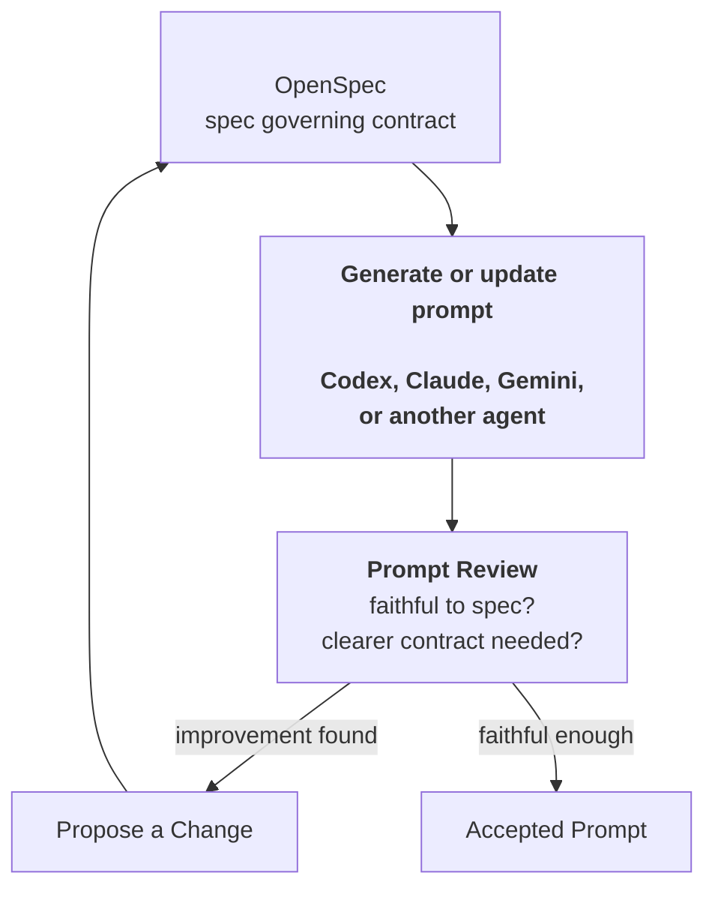

# udt-platforms-map

A spec-first research repository for collaborating with AI agents on Urban Digital Twin platform research.

This repo uses OpenSpec because the canonical prompts are not one-time prompts.
They are maintained research actions that are rerun, reviewed, compared, and improved over time, so they need explicit inputs, output contracts, review history, and traceable changes.

An OpenSpec spec is a behavior contract, not an implementation plan.
In this repository, specs define what a research action must do, including classification behavior, source policies, scoring rules, and output contracts.

The `plan/` folder contains run inputs used by those actions, such as selected comparison sets, benchmark fixtures, and run-specific scope material.

A prompt is the operational implementation of the contract: copy-ready instructions that combine the relevant behavior specs and run inputs so an agent can perform the research action.
When a canonical prompt is unclear or incomplete, the stronger fix is usually to clarify the contract first, then regenerate or update the prompt.
Small prompts and one-off experiments can still be direct when they are not part of the governed workflow.

Git records how the research artifacts and contracts evolve over time.

## Workflow

The repository follows an action research loop:

```text
PLAN -> ACT -> OBSERVE -> REFLECT
```

- `plan/` contains run inputs such as selected comparison sets, benchmark fixtures, and run-specific scope material.
- `act/` contains canonical prompt templates for running research, benchmarking, and reporting actions.
- `observe/` stores saved model outputs and generated coverage artifacts.
- `reflect/` contains synthesized reporting, comparison, and reflection artifacts.

## Research Actions

The first discovery actions are intentionally broad:

- Platform discovery finds technical artifacts and classifies them using the stable `Type` contract.
- Initiative discovery finds projects, programmes, and deployments, and records `Uses = ?` when the technical substrate is unclear.

Platform comparison is the stricter evaluative stage. Only rows classified as `Type = platform` by platform discovery are eligible for platform comparison.

Canonical actions include:

- discover platforms
- discover initiatives
- compare platforms
- benchmark platform discovery
- report platform discovery
- benchmark platform comparison
- report platform comparison

## How To Work

1. Start from the relevant behavior spec in `openspec/specs/` and any run input in `plan/`.
2. Run the matching canonical prompt from `act/`.
3. Save raw model outputs and coverage artifacts in `observe/`.
4. Synthesize reports, comparisons, and reflections in `reflect/`.
5. Improve prompts and workflow behavior through OpenSpec changes.
   One agent can generate or update a prompt from a governing spec, another agent reviews whether the prompt faithfully interprets that spec, and accepted improvements are captured as OpenSpec deltas before updating the baseline.

A useful reviewer question is: does `act/discover-platforms.md` faithfully implement the `platform-definition` behavior contract?



## Health Checks

Use these checks when reviewing, handing off, or committing repository work:

```bash
openspec validate --all --strict
git status --short
```

Use `openspec validate <change-name> --strict` before applying or archiving a specific OpenSpec change.
These checks confirm repository contract health and working-tree state; they do not verify research truth, evidence quality, or model-output completeness.

## Specs

Formal repository contracts live in [openspec/specs/](openspec/specs/), especially:

- [repo-structure](openspec/specs/repo-structure/spec.md)
- [repo-naming-conventions](openspec/specs/repo-naming-conventions/spec.md)
- [repo-prompt-review](openspec/specs/repo-prompt-review/spec.md)
- [repo-readme](openspec/specs/repo-readme/spec.md)
- [platform-definition](openspec/specs/platform-definition/spec.md)
- [initiative-definition](openspec/specs/initiative-definition/spec.md)
- [platform-comparison-rubric](openspec/specs/platform-comparison-rubric/spec.md)
- [platform-source-policy](openspec/specs/platform-source-policy/spec.md)
