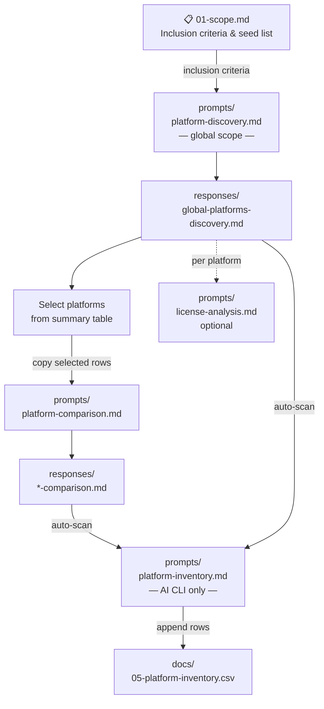

# udt-platforms-map

A structured research repository for mapping Urban Digital Twin (UDT) platforms similar or adjacent to DTCC.

## Goal

Produce a comprehensive landscape review of existing UDT platforms — understanding their technical architecture, openness, city-scale capability, maturity, integration posture, and governance — to inform DTCC's technical and strategic direction.

## Research Workflow

## Directory Layout

| Directory      | Purpose                                                                                                      |
| -------------- | ------------------------------------------------------------------------------------------------------------ |
| `docs/`        | Scope, methodology, source policy, license review approach, and the canonical platform inventory             |
| `prompts/`     | Prompt templates for AI-assisted platform discovery, comparison, inventory curation, and license analysis    |
| `responses/`   | Raw AI responses saved for reference and verification                                                        |

## Key Documents

- [`docs/01-scope.md`](docs/01-scope.md) — inclusion and exclusion criteria, seed list
- [`docs/02-methodology.md`](docs/02-methodology.md) — research approach and file naming conventions
- [`docs/03-source-policy.md`](docs/03-source-policy.md) — acceptable sources and citation format
- [`docs/04-license-review.md`](docs/04-license-review.md) — how to evaluate platform licenses
- [`docs/05-platform-inventory.csv`](docs/05-platform-inventory.csv) — canonical platform table
