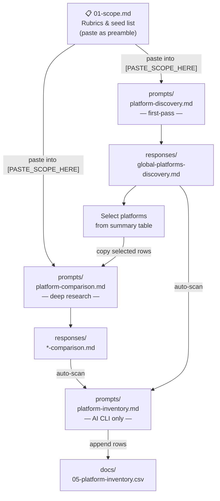

# Research Methodology

## Research Approach

Each platform is researched using primary sources only (see `docs/03-source-policy.md`).
Findings are synthesized into `docs/review.md`.
The canonical data record for each platform is its row in `docs/05-platform-inventory.csv`.

## Discovery to Comparison Workflow

1. Open `docs/01-scope.md` and copy the full content
2. Run a discovery session using `prompts/platform-discovery.md`:
   - Paste the copied scope content into the `[PASTE_SCOPE_HERE]` slot
   - Paste the prepared prompt into your AI session
   - Save the response to `responses/`
3. Open the saved response and choose which platforms to compare
4. Run a comparison session using `prompts/platform-comparison.md`:
   - Paste the copied scope content into the `[PASTE_SCOPE_HERE]` slot
   - Copy the rows you want to compare (including the header row) from the discovery summary table
   - Paste them into the `[PASTE_SELECTED_PLATFORMS_HERE]` token
   - Paste the prepared prompt into your AI session
   - Save the response to `responses/`

Discovery dimension scores are judgment-based first-pass signals.
The comparison prompt deepens them with full rubric-based research and primary source evidence — expect scores to shift.

## File Naming

All filename components use only lowercase letters, digits, and hyphens (kebab-case).
No spaces, underscores, or uppercase.

### Response files (`responses/`)

Pattern: `<platform>-<prompt-type>.md`

| Token           | Values                                                |
| --------------- | ----------------------------------------------------- |
| `<platform>`    | kebab-case platform name, e.g. `cesium`, `3d-city-db` |
| `<prompt-type>` | `discovery` or `comparison`                           |

Examples:

- `cesium-vs-dtcc-comparison.md` — two platforms joined with `vs`
- `cesium-et-al-comparison.md` — more than two platforms
- `european-platforms-discovery.md` — broad discovery session; use a scope descriptor instead of a platform name

If a session is re-run for the same platform and prompt type, overwrite the file.
Git history preserves the previous version.

### Session logs (`search_logs/`)

Pattern: `<platform>.md` — one file per platform, updated as research evolves.

## CSV Column Reference

The canonical inventory is at `docs/05-platform-inventory.csv`. Column order:

`Name`, `Link`, `Phase`, `Relevance`, `Arch`, `Open`, `City`, `Mature`, `Integ`, `Gov`, `Viz`, `DM`, `Sim`, `IoT`, `Std`, `Infra`, `Model`, `Date`

| Column     | Description                                                                    |
| ---------- | ------------------------------------------------------------------------------ |
| Name       | Platform name                                                                  |
| Link       | Primary URL (raw, no Markdown syntax)                                          |
| Phase      | Prompt type that produced the row: `discovery` or `comparison`                 |
| Relevance  | 0–5 relevance score per rubric in `docs/01-scope.md`; 0 = not assessed         |
| Arch–Infra | Dimension and functional category scores (0–5); 0 = not assessed at this phase |
| Model      | AI model that produced the row                                                 |
| Date       | Session date (YYYY-MM-DD)                                                      |

Score columns use integers 0–5 or `?` for unknown. There is no `-1` sentinel.
